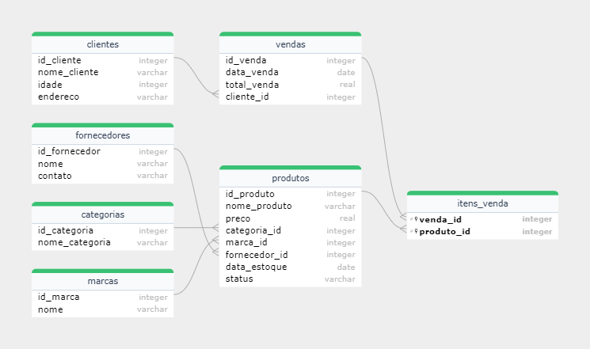

# Banco de Dados I

- Projeto: EDA (Análise Exploratória de Dados) em Banco de Dados PostgreSQL
- Curso: Data Science - Santander Coders 2023 | 2º Semestre
- Módulo: Banco de Dados I
- Professor: Aruã de Mello Sousa

## Por: Otávio Sotnas - ID: 1116014 e Tainah Guerra - ID: 1116005

## 1. Objetivo

Este projeto tem como principal objetivo aplicar os
conhecimentos adquiridos ao longo da disciplina de Banco de dados I em
um contexto prático, relevante e data-driven, afim de gerar insights valiosos e responder perguntas de negócio. 
Utilizando o PostgreSQL para construção,carregamento e análise dos dados.

## 2. Metodologias Ágeis 

Para este projeto foi utilizada a ferramenta  de gestão de projetos Trello. Utilzado para manter o projeto organizado,
facilitare a colaboração entre os membros da equipe e garantir que o projeto seja concluído dentro do prazo estabelecido.

Link: https://trello.com/b/yLjzU1Dh/projeto-sql-ada

## 3. Data-Set

Essa base de dados apresenta, de forma fictícia, dados de vendas da **Zoop Megastore**
do período de 01/2020 a 10/2023. 

### 3.1 Informações das tabelas

 ``categorias:``  Informações sobre as categorias dos produtos.

``clientes:`` Informações sobre o cliente e sua localização.

``fornecedores:`` Informações sobre os fornecedores dos produtos.

``marcas:`` Informaçõess das marcas dos produtos. 

``produtos:`` Informações sobre os produtos vendidos na loja.

``vendas:`` Informações sobre as vendas processadas.

``itens_venda:`` Informações sobre os produtos adquiridos em cada venda.

Importante salientar que estes dados foram retirados de um dos cursos da ALURA, estando o arquivo anteriormente apenas disponível em formato .DB. 
Porém foi realizada a devida conversão para CSV, assim viabilizando a realização deste projeto.

